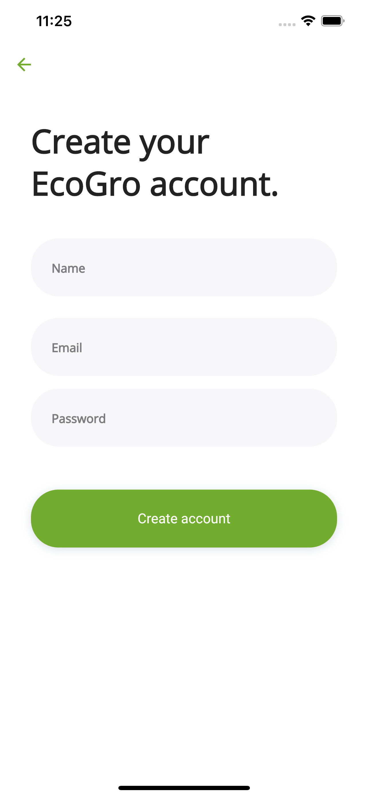
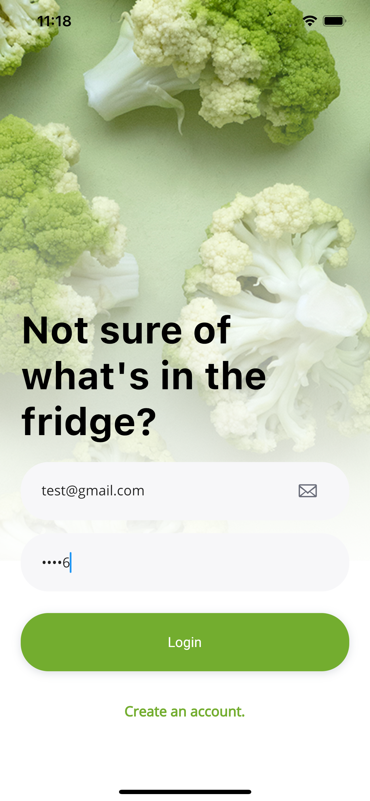
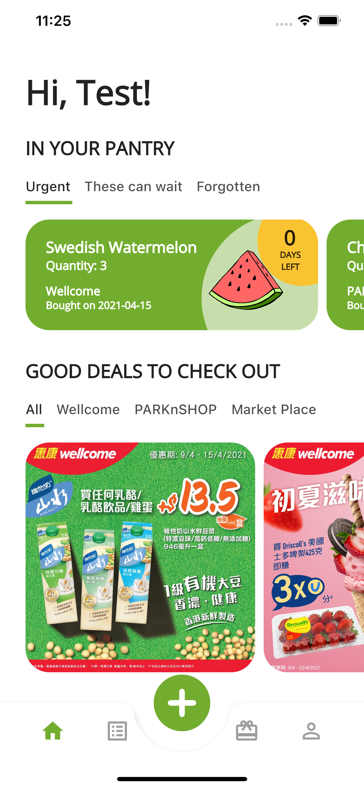
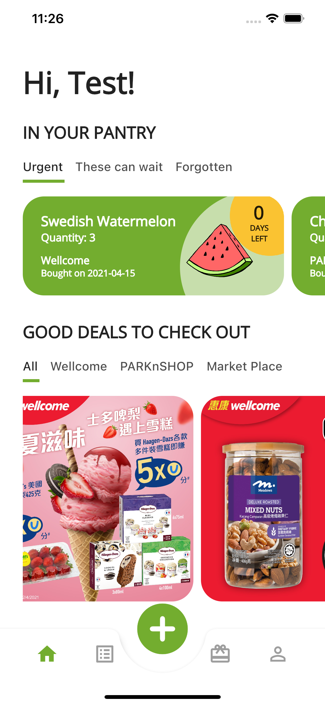
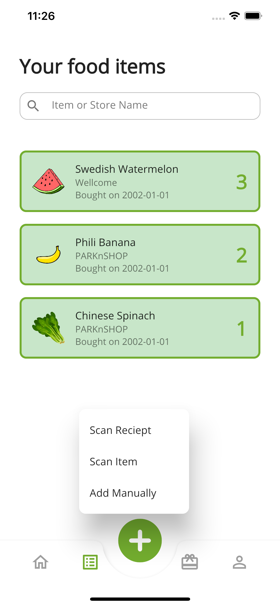
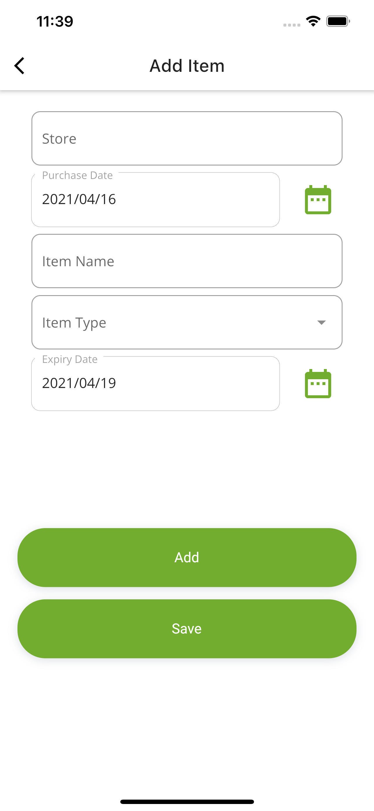
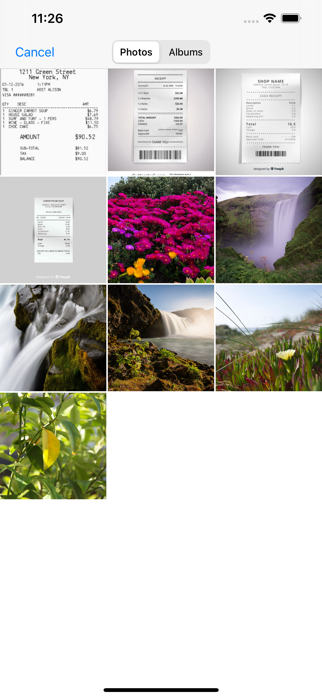
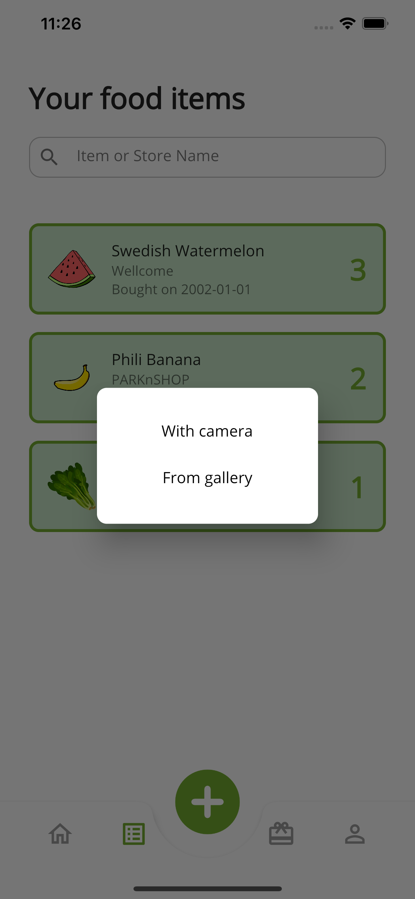
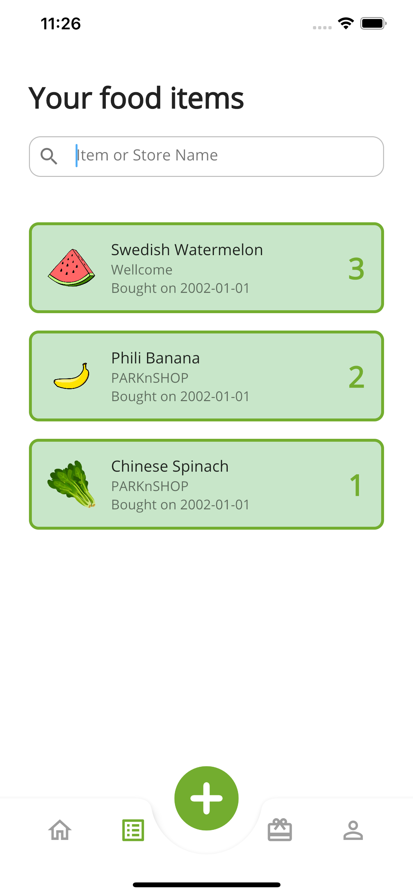
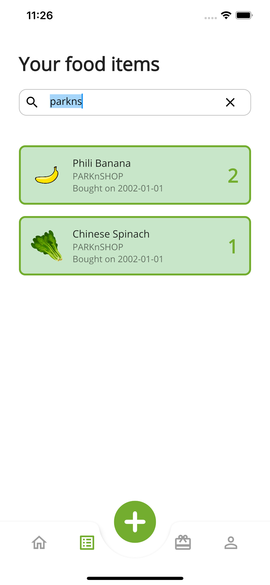

# EcoGro 🥬🍅🍌

Discover your food wastage habits by scanning your grocery receipts using image processing and tracking your food quantity at home.

## App Overview
### 1. User creates an account
Before logging into the account, the user needs to set it up beforehand. Once the registration is successful, the user then logs in and is redirected to the home screen.

    
    
    

<!--  -->

### 2. Home screen
The home page consists of 2 main sections:
1. In Your Pantry 
2. Good Deals to Check Out
### In Your Pantry
### Good Deals to Check Out
Advertisements from local supermarkets can be displayed here, and this gives a 3-way benefit. First, discount-hunting customers have the ease of viewing discount ads. Secondly, supermarkets can reach out to customers directly for advertising. Thirdly, we as the business/app owner will be able to earn revenue from the ads.

    
    

### 3. Add food items to inventory
Users can keep track of their store-bought groceries in 3 ways:
1. Scanning their receipt
2. Scanning an image of the food item
3. Manually keying in the food details

    
    

For the scanning of receipts, the user will upload the image and it will be sent to an API by [Veryfi](https://www.veryfi.com/). This sends back a JSON object, where food details are saved to the database. The user can then modify individual records directly.

    
    

### 4. Records page
Once the food records are saved, it will be displayed on the records page for the user's easy reference.

    
    

## How to run the app
1. Follow guidelines on the [Flutter documentation](https://flutter.dev/docs/get-started/install).
2. Clone this repo or download it as a zip file.
3. Open zip file in VS Code and install the [Flutter extension](https://marketplace.visualstudio.com/items?itemName=Dart-Code.flutter).
4. Choose your simulator (e.g. iPhone 12 Pro Max).
5. Run your debug tool and select 'Dart and Flutter' as your environment.

## Main Technologies used (or for future consideration)
1. Flutter (cross-platform SDK)
2. Firebase - Firestore and Authentication
3. (In progress) Veryfi API
4. (In progress) Google ML Kit (for machine learning to analyze receipt data)